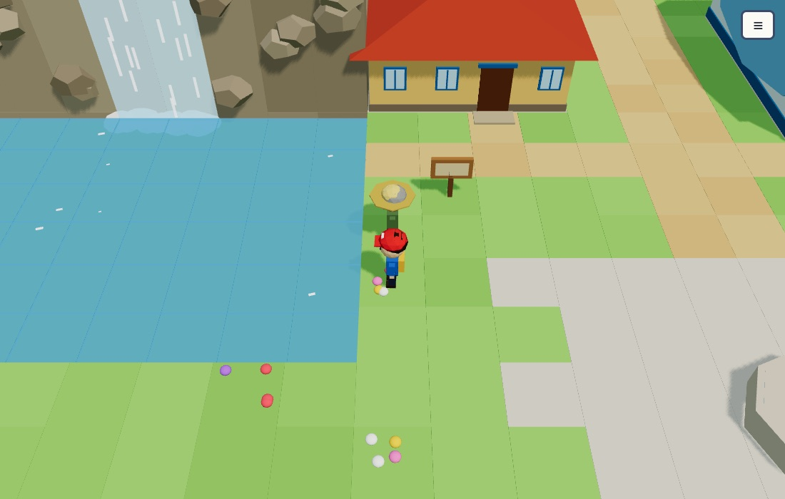
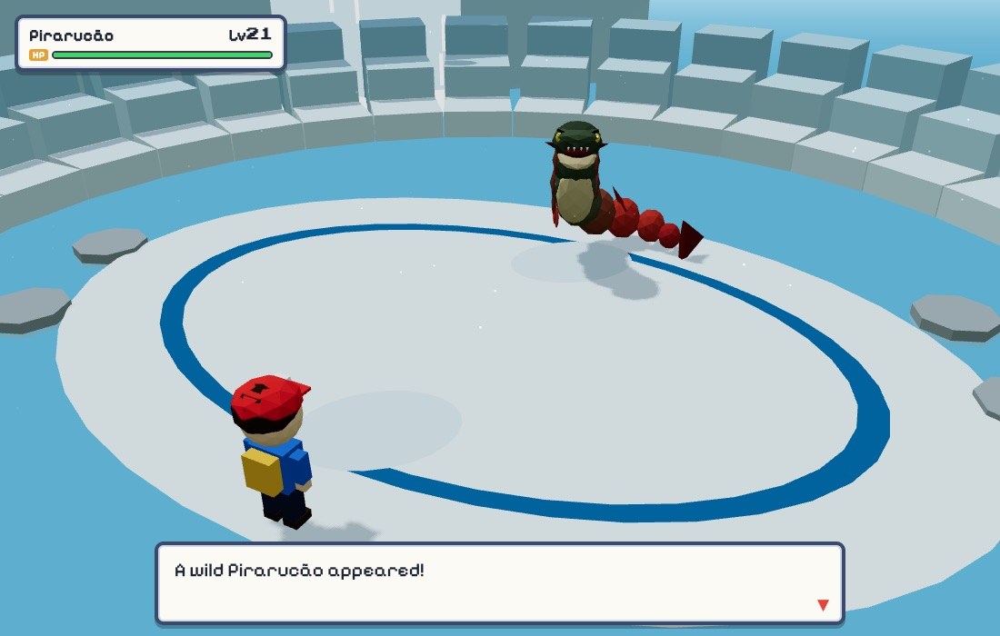
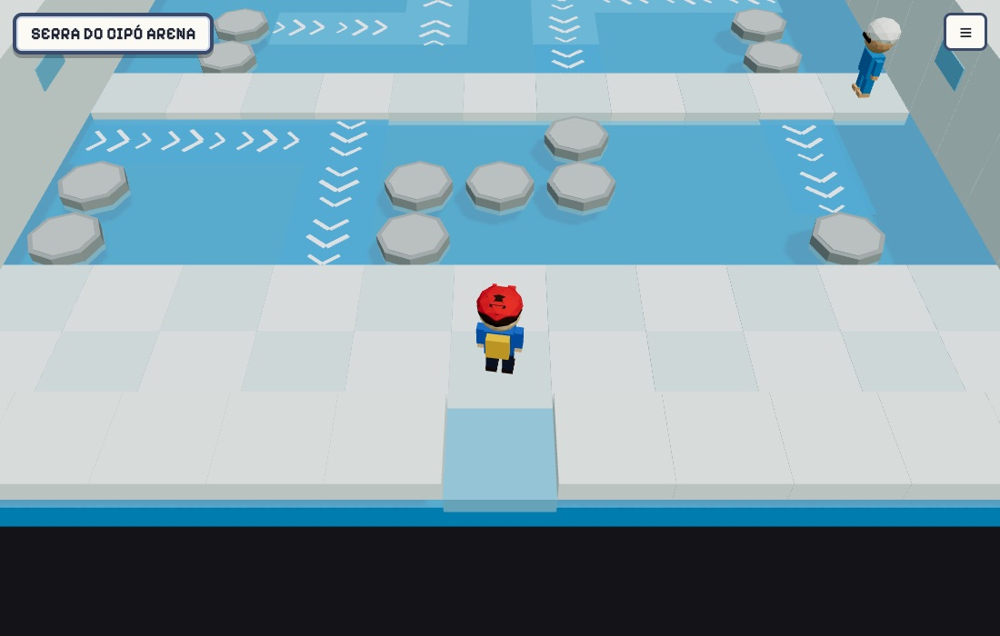
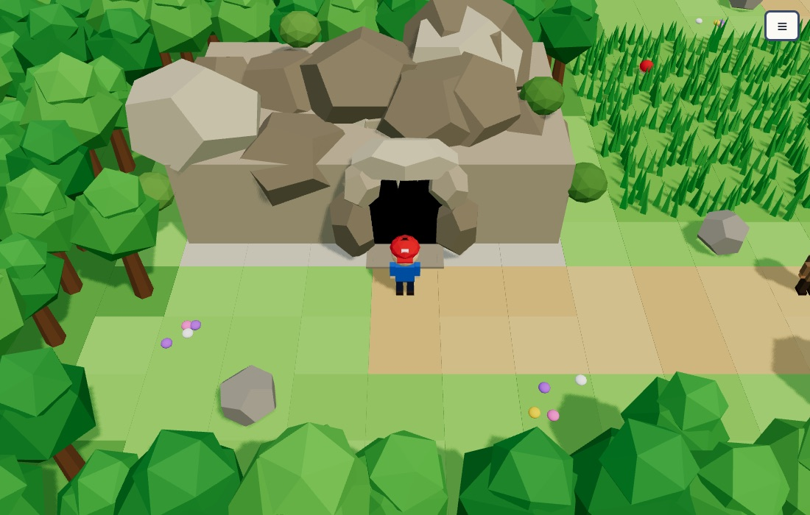
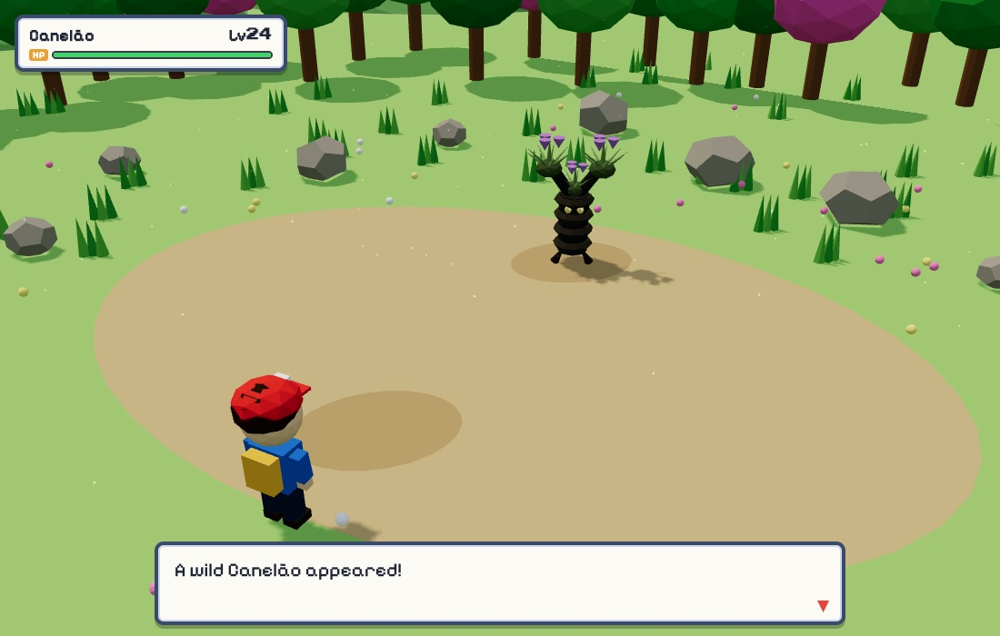

# Encantados

**A 3D creature-collecting RPG that runs in the browser, set in a folklore-flavoured Brazil.** Leave your hometown with a starter, catch and raise creatures based on Brazilian fauna and legends, battle trainers and Arena Leaders, and fill a bilingual (English/Portuguese) Almanaque.

**[▶ Play in your browser](https://julian-reyes.github.io/encantados/)**: no install, works with keyboard or touch.



| | |
| --- | --- |
|  |  |
|  |  |

## Tech highlights

- **React Three Fiber and three.js.** The overworld, interiors, caves and battle sets are rendered in real time. Terrain, trees and grass use instanced meshes, so thousands of tiles cost a few dozen draw calls.
- **No asset files for art or sound.** Every creature, character and building is modelled procedurally in TypeScript from primitive shapes. The music and sound effects come from a small WebAudio chiptune synthesizer.
- **Data-driven world.** Maps are ASCII layouts. NPCs, trainers, signs, items and encounter tables are plain data, and story events are async scripts that lock the player while they run. Puzzles such as water currents and cave ladders are tile rules.
- **Turn-based battle engine** with type effectiveness (including immunities), stat stages, status conditions, catching, experience, move learning, evolution and teachable MTs.
- **Bilingual:** every line of text exists in English and Portuguese.
- **Regression tests** (`node --test`) load the real game modules. They check battle flow, saves, map reachability, puzzle traps, and backwards-compatible saves.
- **One-file build:** `npm run build` inlines scripts, styles and fonts into a single `dist/index.html`. It's deployed to GitHub Pages by a GitHub Actions workflow.

## Run it locally

```sh
npm install
npm run dev
```

Build a standalone game with `npm run build`. The output is **dist/index.html**, including JavaScript, styles and fonts. Open it in a modern WebGL browser or host it as a static file. Saves belong to the browser and URL you play from; changing browser or hosting location does not transfer them.

Run the gameplay regression checks with `npm test` (Node 20.19+). These load the actual game modules without listening on an HTTP port.

## Controls

| Action | Keyboard |
| --- | --- |
| Walk / select | Arrow keys or WASD |
| Talk / inspect / confirm (A) | Z, Enter, Space or J |
| Back / cancel (B) | X, Shift or K |
| Run | Hold B while walking |
| Menu | Esc or M |

Touch devices show a D-pad and A/B/Start buttons. You can also enable these in Options. Click or tap dialogue once to reveal the whole line, then again to advance. Names use a text field and its OK button.

Leave your house and head north to meet Professor Jatobá. Choose an amulet at the lab table, then explore Route 1. Weaken wild creatures before using an Amulet; extras beyond your six-member team go to the Healing Center PC. Healing Centers and Mom restore HP, move PP and status. Save through the menu before closing the game.

## Included

- Three starters, twelve other base species, and fourteen evolutions; 29 Almanaque entries.
- Turn-based battles, elemental effectiveness, statuses, catching, nicknames, experience, move learning and cancellable evolution.
- A rival, route trainers, the Garimpo Sombrio grunts, Arena Leaders Topázio and Marina, shops, healing items, storage, signs, dialogue and pickups.
- MTs that teach a move from the Bag (each leader gives one), and a fishing rod for rivers and ponds.
- Marina's pool arena, where currents carry you across the water.
- A three-floor cave with ladders, cave encounters and a fossil to choose.
- English/Portuguese options, synthesized music and effects, local saves and mobile controls.
- Instanced terrain/vegetation, a 1.5 pixel-ratio cap and one 1024-pixel shadow map.

Route 3 climbs from Route 2 to the Gruta da Lapinha. The cave's north tunnel opens onto Route 4 and Serra do Cipó, where the bridge north is still under construction. See [docs/ROADMAP.md](docs/ROADMAP.md) for the plan for the rest of the game.

## Validation

Automated checks cover dialogue sequencing, battle entry, exhausted parties, trainer rewards, catching into storage, leveling, save/load, type immunities, species data, and map data (everyone stands somewhere walkable, every cave ladder is paired and the whole cave can be reached, Route 4 and Serra do Cipó can be reached, and no current in Marina's arena can trap you), MT compatibility, and saves made before the map grew north. Browser checks use the production HTML in headless Chrome; this does not establish performance on a 2017 MacBook Pro or audio quality on physical speakers.

Pixelify Sans and Press Start 2P are bundled under the SIL Open Font License. Notices are in `src/assets/fonts` and embedded in the generated HTML.

## About

Encantados is a fan-made project inspired by the classic handheld creature RPGs. All creatures, characters, places, music and models are original. © 2026 Julian Reyes. All rights reserved.
